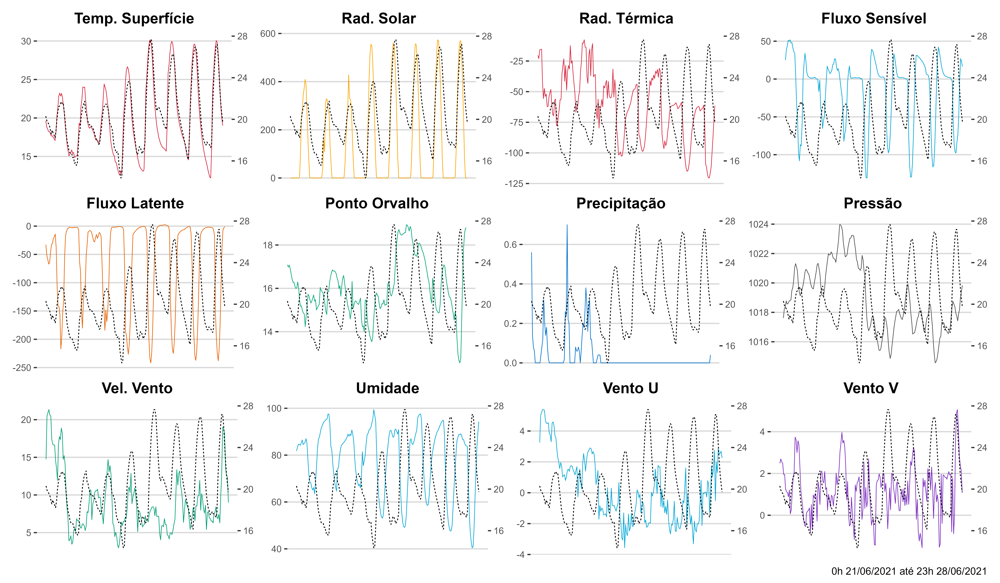
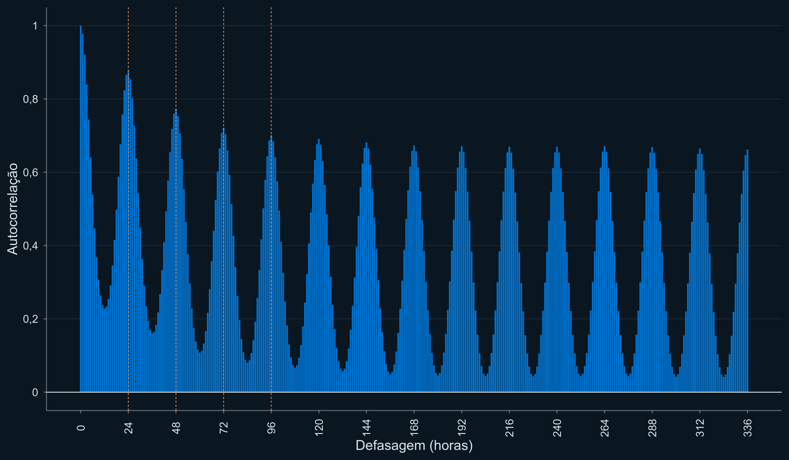
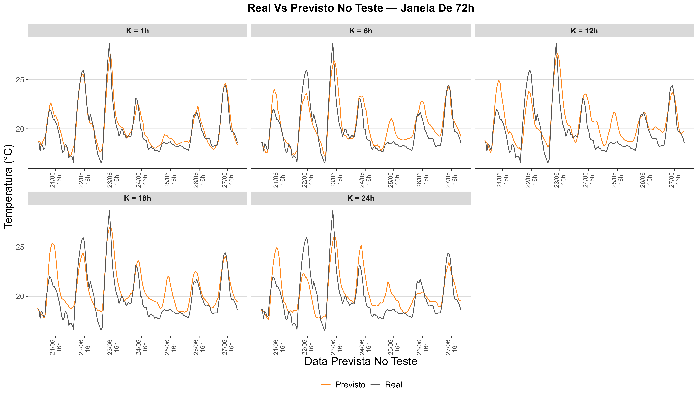
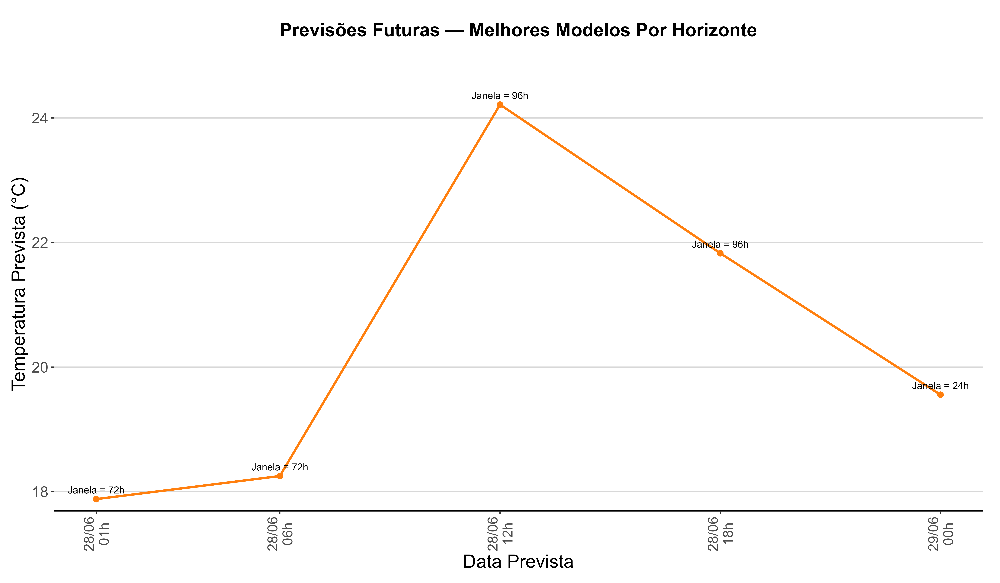
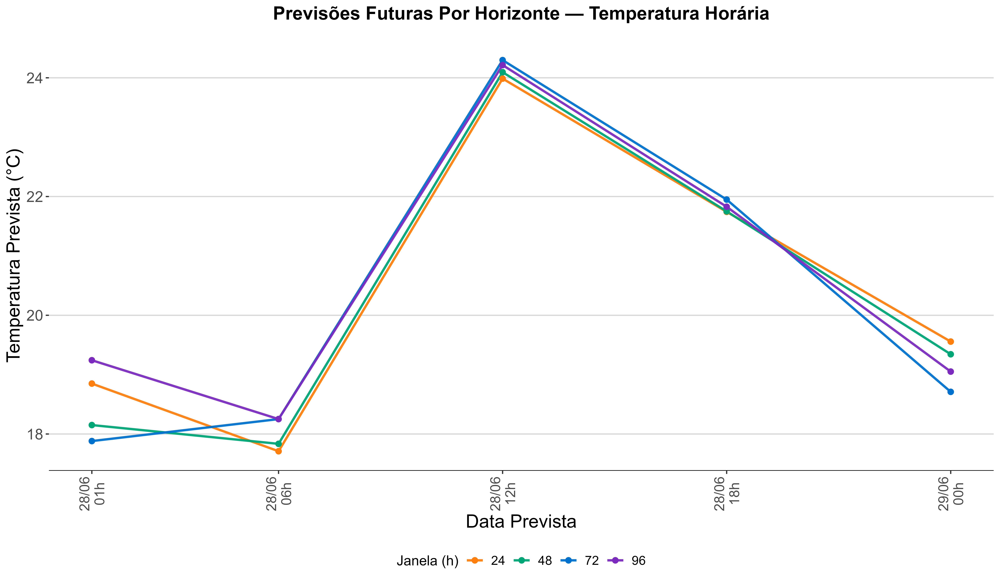

# Introdução {.transition-slide}

## Motivação

:::: {.columns}

::: {.column width="70%"}

::: {.box-teal style="font-size: 0.75em;"}

  O Problema

- Previsão de temperatura horária é **simples e útil** no cotidiano
- Influencia saídas, atividades ao ar livre, consumo de energia e conforto térmico
- Temperatura varia ao longo do dia em padrões **recorrentes e aprendíveis**

:::

:::

::: {.column width="5%"}

:::

::: {.column width="25%"}

{width="250"}

:::

::::

 

:::: {.columns}

::: {.column width="20%"}

{width="250"}

:::

::: {.column width="5%"}

:::

::: {.column width="70%"}

::: {.box-copper style="font-size: 0.75em;"}

  O Objetivo

- Treinar modelos **LSTM** para prever a **temperatura horária do ar** em Niterói, RJ
- Comparar modelos — diferentes janelas e horizontes de previsão

:::

:::

::::

# Dados {.transition-slide}

## Os dados

:::: {.columns}

::: {.column width="48%"}

::: {.box-teal  style="font-size: 0.6em;"}

  Origem

:::: {.columns}

::: {.column width="75%"}

- **ERA5-Land** — base principal
  - ECMWF & Copernicus
  - Resolução espacial: <code class="teal">~9 km</code>
  - Resolução temporal: <code class="teal">1 h</code>
  - Sem NAs — dado de satélite + modelo físico
  - Atraso de até **6 dias** em relação à data atual

:::

::: {.column width="25%"}

{width="250"}

:::

::::

- **Open Meteo / NASA GEOS-FP** — complemento
  - Cobrem os dias mais recentes via API
  - Viabilizam previsões para **datas futuras**

:::

 

::: {.box-teal style="font-size: 0.6em;"}

  Cobertura

- **Local:** Niterói, RJ

- **Período:** 0h 31/12/2009 → 23h 30/06/2026

:::

:::

::: {.column width="4%"}

:::

::: {.column width="48%"}

::: {.box-copper style="font-size: 0.75em;"}

| Variável | Unidade |
|----------|:-------:|
| [**Temperatura do ar**]{style="color:#E8A552; font-weight:700;"} | °C |
| Temperatura da superfície | °C |
| Radiação solar líquida | J/m² |
| Radiação térmica líquida | J/m² |
| Fluxo de calor sensível | J/m² |
| Fluxo de calor latente | J/m² |
| Ponto de orvalho | °C |
| Precipitação | mm |
| Vento Leste-Oeste | m/s |
| Vento Norte-Sul | m/s |
| Pressão atmosférica | Pa |
| Umidade relativa | % |
: {.tabela-tema .tabela-tema-destaque1}

:::

:::

::::

# Metodologia {.transition-slide}

## Metodologia

  
::: {.box-teal}
Análise Descritiva
:::

→

::: {.box-copper}
Proposição das Hipóteses
:::

→

::: {.box-teal}
Processamento dos Modelos
:::

→

::: {.box-copper}
Análises e Comparações
:::

:::: {.columns}

::: {.column width="22%"}

::: {.box-teal style="font-size: 0.78em;"}

  Divisão da Base

| Conjunto | Prop. |
|----------|:-----:|
| Treino | **70%** |
| Validação | **15%** |
| Teste | **15%** |
: {.tabela-tema}

- Divisão **cronológica**

- Cada partição cobre **todas as estações**

:::

:::

::: {.column width="2%"}

:::

::: {.column width="22%"}

::: {.box-copper style="font-size: 0.78em;"}

  Janelas (h)

| Janela | Captura |
|:------:|---------|
| **24h** | 1 dia |
| **48h** | 2 dias |
| **72h** | 3 dias |
| **96h** | 4 dias |
| **168h** | 7 dias |
: {.tabela-tema}

:::

:::

::: {.column width="2%"}

:::

::: {.column width="22%"}

::: {.box-teal style="font-size: 0.69em;"}

  Horizontes (k)

| k | Alvo |
|:-:|------|
| 1h–24h | Horária |
: {.tabela-tema}

 

- **96 modelos** treinados
- Mesma arquitetura em todos
- Isolando o efeito da janela e do *k*

:::

:::

::: {.column width="2%"}

:::

::: {.column width="24%"}

::: {.box-copper style="font-size: 0.7em;"}

  Arquitetura LSTM

- **64 unidades** LSTM
- *Dropout* **0,2**
- Otimizador **Adam**
- Taxa de aprendizado **0,001**
- *Early stopping* na validação
- 3–5 épocas por modelo

 

**Métricas:** RMSE · MAE · R²

:::

:::

::::

# Exploração {.transition-slide}

## Análise Descritiva

{fig-align="center" width="80%"}

## Autocorrelação da Temperatura Horária

{fig-align="center" width="80%"}

# Resultados {.transition-slide}

## Todos os Modelos

::: {.box-copper style="font-size: 0.62em;"}

| Alvo | Janela (h) | Horizonte | RMSE (°C) | MAE (°C) | R² |
|------|:----------:|:---------:|:---------:|:--------:|:--:|
| **TempHoraria** | **72** | **1h** | **0,811** | **0,613** | **0,962** |
| TempHoraria | 72 | 6h | 1,081 | 0,777 | 0,932 |
| TempHoraria | 96 | 12h | 1,341 | 0,969 | 0,895 |
| TempHoraria | 96 | 18h | 1,514 | 1,093 | 0,866 |
| TempHoraria | 24 | 24h | 1,716 | 1,240 | 0,828 |
: {.tabela-tema}

:::

## Melhores Modelos

:::: {.columns}

::: {.column width="48%"}

::: {.box-teal style="font-size: 0.82em;"}

  Melhor Modelo — Temperatura Horária

| Alvo | Janela | Horizonte | RMSE | R² |
|------|:------:|:---------:|:----:|:--:|
| Horária | 72h | 1h | **0,811** | **0,962** |
: {.tabela-tema}

:::

:::

::: {.column width="4%"}
:::

::: {.column width="48%"}

::: {.box-copper style="font-size: 0.82em;"}

  O que os resultados mostram

- O melhor modelo é sempre o de **menor horizonte** (1h)
- Desempenho se deteriora progressivamente com o aumento de *k*
- **Temp. horária (1h)** é o grande destaque: RMSE de apenas **0,81 °C**

:::

:::

::::

## Previsão vs. Real — Temperatura Horária

{fig-align="center" width="80%"}

## Modelos Definitivos — Horária

{fig-align="center" width="80%"}

## Previsões Futuras

{fig-align="center" width="80%"}

# Conclusão {.transition-slide}

## Conclusão

:::: {.columns}

::: {.column width="48%"}

::: {.box-teal style="font-size: 0.82em;"}

  O que foi feito

- **96 modelos LSTM** treinados e comparados
- Variável-alvo: temperatura horária
- Janelas de **24h a 168h**, horizontes de **1h a 24h**
- Mesma arquitetura em todos os modelos — isolando o efeito dos hiperparâmetros
- Previsões geradas para **datas futuras**

:::

:::

::: {.column width="4%"}
:::

::: {.column width="48%"}

::: {.box-copper style="font-size: 0.82em;"}

  Principais Resultados

- LSTM demonstrou **excelente desempenho** na previsão horária de curto prazo — R² = **0,96**, RMSE = **0,81 °C**
- Desempenho cai com o aumento do horizonte
- A arquitetura conseguiu capturar **padrões sazonais** e extrapolá-los para horários futuros

:::

:::

::::

# Fim. {.unnumbered .final-slide}